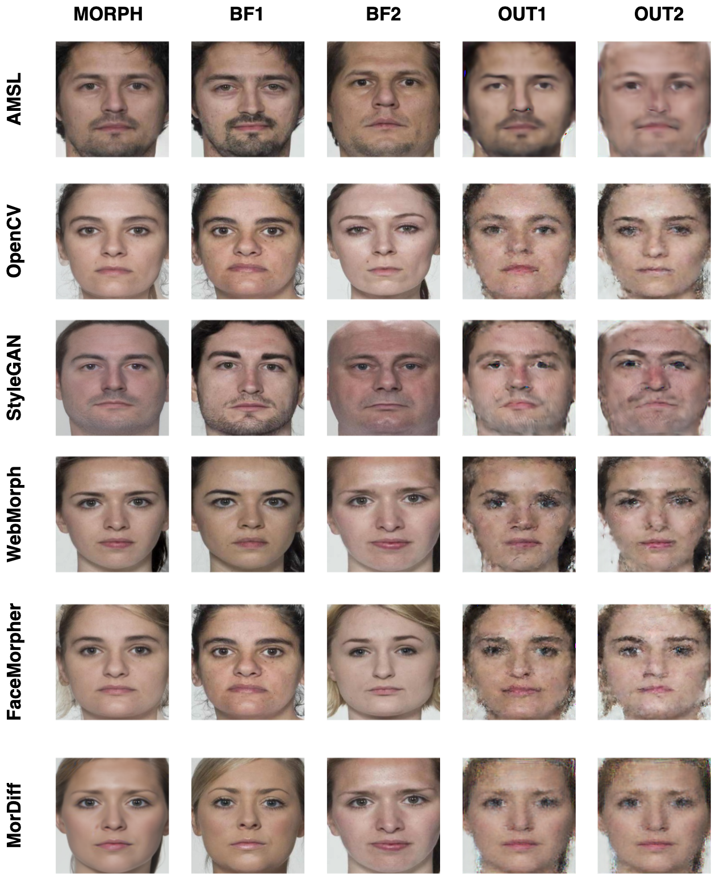
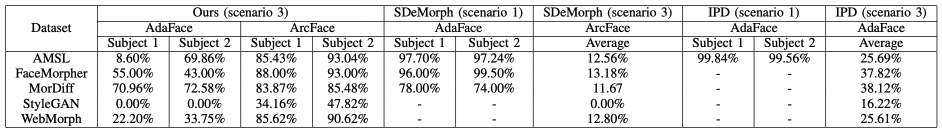

# dc-GAN: Dual-Conditioned GAN for Face Demorphing From a Single Morph

**Authors:** Nitish Shukla, Arun Ross  
**Venue:** IEEE 19th International Conference on Automatic Face and Gesture Recognition (FG 2025)


## Abstract

A facial morph is an image strategically created by combining two face images pertaining to two distinct identities. The goal is to create a face image that can be matched to two different identities by a face matcher. Face demorphing inverts this process and attempts to recover the original images constituting a facial morph. Existing demorphing techniques have two major limitations: (a) they assume that some identities are common in the train and test sets; and (b) they are prone to the morph replication problem, where the outputs are merely replicates of the input morph. In this paper, we overcome these issues by proposing dc-GAN (dual-conditioned GAN), a novel demorphing method conditioned on the morph image as well as the embedding extracted from the image. Our method overcomes the morph replication problem and produces high-fidelity reconstructions of the constituent images. Moreover, the proposed method is highly generalizable and applicable to both reference-based and reference-free demorphing methods. Experiments were conducted using the AMSL, FRLL-Morphs, and MorDiff datasets to demonstrate the efficacy of the method. 

## Methodology


*Dual-Conditioned GAN for Reference-Free Demorphing: An image encoder, E, encodes the morph image, which is then used to condition the generator. The generator, based on a UNet architecture, G, takes in the MORPH image and the encoded representation, E(MORPH), producing two outputs, OUT1 and OUT2. The discriminator is trained to distinguish between the real set (MORPH, BF1, BF2) and the synthetic set (MORPH, OUT1, OUT2), differentiating real from synthetic pairs.*

### Contribution

- **Reference-Free & Differential Demorphing**: Works seamlessly in both settings without extra constraints.  
- **Artifact Robustness**: Effectively handles high-frequency artifacts introduced during the demorphing process.  
- **Morph Replication Prevention**: First method to overcome morph replication, even on unseen identities.  


## Results

The proposed method was evaluated on several benchmark morph datasets, demonstrating superior performance in demorphing accuracy compared to existing techniques. Quantitative results show significant improvements in terms of both visual fidelity and identity preservation.


*Figure 2: Reference-Free Demorphing Visualization: We illustrate the results of our reference-free demorphing approach. The model takes the morph image (MORPH) as input and produces two outputs (OUT1 and OUT2). The ground-truth images used to generate the morph are denoted as BF1 and BF2.*


*Figure 3:  Differential Demorphing Visualization: We illustrate the results of our differential demorphing approach. The model receives the morph image (MORPH) and the transformed ground-truth image (TRANSFORMED BF1) and produces an output (OUT). The ground truth (GT) is shown, which, along with the ground-truth image (BF1), was used to generate the morph image (MORPH). Note that our method does not assume that the demorphing process uses the exact same ground-truth image (BF1) that was used to create the morph. *
*

*Table 1: Restoration Accuracy: Comparison of our reference-free approach to SDeMorph \cite{ref18} and Identity-Preserving Demorphing (IPD) \cite{ref66}. Unlike our method, which operates on unseen faces (scenario 3) and is significantly more challenging, the other methods assume the same identities are present in both training and test morphs (scenario 1). In scenario 3, our method significantly outperforms the current state-of-the-art method.*



## Usage

To use dcGAN, follow these steps:

1. **Clone the repository**
```bash
git clone 
cd Facial-Demorphing-from-a-Single-Morph-Using-a-Latent-Conditional-GAN
```

2. **Download model weights**
```bash
mkdir pretrained
from huggingface_hub import hf_hub_download
model_path = hf_hub_download(
    repo_id="nitishshukla/pretrained-weights",
    filename="dcGAN-AMSL-RF.pth",
    local_dir="./pretrained"
)
```


3. **Run testing.ipynb**


## Citation

```
@INPROCEEDINGS{11099072,
  author={Shukla, Nitish and Ross, Arun},
  booktitle={2025 IEEE 19th International Conference on Automatic Face and Gesture Recognition (FG)}, 
  title={dc-GAN: Dual-Conditioned GAN for Face Demorphing From a Single Morph}, 
  year={2025},
  volume={},
  number={},
  pages={1-9},
  keywords={Face recognition;Gesture recognition;Image reconstruction},
  doi={10.1109/FG61629.2025.11099072}}


```

## License

This work is licensed under a [CC BY 4.0](https://creativecommons.org/licenses/by/4.0/) license.

---

For more details, please refer to the full paper: [arXiv:2507.18566](https://arxiv.org/pdf/2411.14494?).

